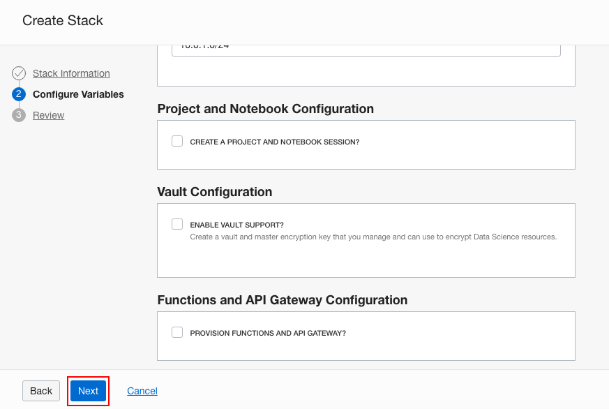
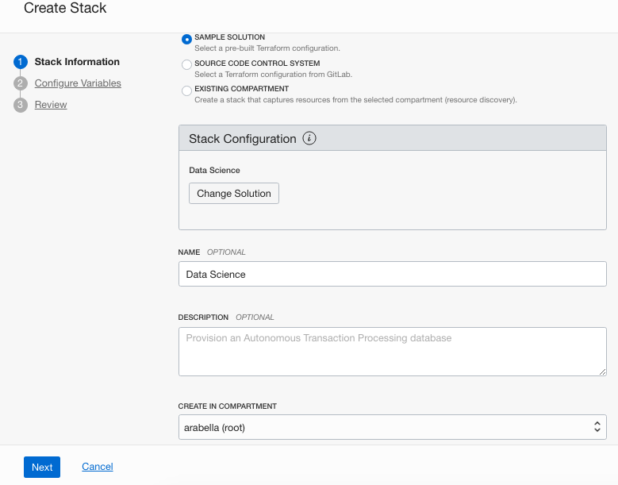

# Data Science Service Setup

## Introduction

To use the Oracle Cloud Infrastructure (OCI) Data Science service, your tenancy has to be configured to grant permission to users and resources. If your tenancy is not already configured, you need administrator permissions to configure it. If you created a free tier account, your account has administrator permissions . There are two ways to configure the tenancy. It can be [manually configured](https://docs.cloud.oracle.com/en-us/iaas/data-science/using/configure-tenancy.htm) or configured via the [Oracle Resource Manager](https://www.oracle.com/cloud/systems-management/resource-manager/). In this lab, your tenancy is configured using the [Data Science Solution Hub](https://docs.cloud.oracle.com/en-us/iaas/data-science/using/orm-configure-tenancy.htm), which is part of the Oracle Resource Manager. The Oracle Resource Manager provides an interface that assists in creating customized stacks that configure a tenancy to work with the Data Science service.

The **Quick-start Tenancy Configuration** and **Advanced Configuration of a Tenancy** both provide instructions on using the Data Science Solution Hub to configure your tenancy. The **Quick-start Tenancy Configuration** provides instructions to set up a basic configuration to work with the Data Science service. We recommend this path for free tier accounts and other tenancies that have a standard configuration. The **Advanced Configuration of a Tenancy** section provides more details and options and should be used if a tenancy needs customization. For more elaborate tenancy configurations, you can [manually configure the resources](https://docs.cloud.oracle.com/en-us/iaas/data-science/using/configure-tenancy.htm).

By default, a tenancy is not configured to work with the Data Science service. If the tenancy is already configured to work with the service, then you can skip the following setup instructions. If you do not know if your account is configured for the service or not, ask your system administrator.

You only need to complete the instructions in the **Quick Start Tenancy Configuration** or the **Advanced Configuration of a Tenancy** if the tenancy is not configured to work with the Data Science service. If you are not sure which set of instructions to follow, start with the **Quick Start Tenancy Configuration**.

*Estimated Time:* 30 minutes

### Objectives

In this lab, you:
* Use the Oracle Resource Manager Solution Hub to create a stack
* Become familiar with the options available to configure a tenancy to work with the Data Science service.
* Apply a stack to create the policies, groups, dynamic groups, VCN, subnet, and other resources need to access the Data Science service.
* Destroy a stack if the stack fails to be applied.

### Prerequisites

* Log into the tenancy using an administrator account.
* Understand your tenancy configuration so that you can determine if you should use the quick start or advanced configuration instructions.

## Quick Start Tenancy Configuration

Configuring a tenancy using Oracle Resource Manager includes creating a solution stack, selecting the solution, providing identifying information for the new stack, and updating variables. For most tenancies, the default options are sufficient. These instructions outline the minimal requirements needed for configuring a tenancy to work with the Data Science service. If your tenancy has a more advanced configuration, then go to **Advanced Configuration of a Tenancy**. For most tenancies, the following instructions are sufficient but minor changes may be needed. It is possible to change the configuration later.

1. [Login to the OCI Console](https://www.oracle.com/cloud/sign-in.html) with an account with administrator permissions.

1. Click the **Navigation Menu** in the upper left, navigate to **Developer Services**, and select **Stacks**.

	

1. Choose a compartment you have permission to work in (on the left side of the page). The page updates to display only the resources in that compartment. If you are not sure which compartment to use, contact an administrator.

1. Click **Create Stack**.

    

1. Click **Sample Solution**, and then click **Select Solution**.
    

1. Select **Data Science**, and then click **Select Solution**.
    

1. Click **Next**. The **Configure Variables** panel displays variables that are automatically populated from the Terraform configuration for the Data Science solution.
    

1. By default the **Use Existing VCN** is unchecked. If you have not created a VCN then leave this option unchecked.  If you have already set up a VCN you will need to use it. Free Trial accounts have a default limit of two VCNs and the stack will fail to build if this box is not checked.
1. Deselect **Create a Project and Notebook Session?**
1. Deselect **Enable Vault Support?**
1. Deselect  **Provision Functions and API Gateway?**
    

1. Click **Next** and review the stack configuration.
1. Click **Create** to create your stack. This creates the stack, but does not create any Data Science resources. The **Stack Details** page appears.
    

1. Click **Terraform Actions**, and then click **Apply** to apply the Terraform script and create the Data Science resources. If the stack generates an error, click **Terraform Actions**, and then click **Destroy** to remove the resources. Fix any issues, and then repeat this step.
    

## Advanced Configuration of a Tenancy

Use these instructions if your tenancy has more than a basic configuration to create a stack and apply it.

Configuring a tenancy using the Oracle Resource Manager includes creating a solution stack, selecting the solution, providing identifying information for the new stack, and updating variables. For advanced configurations, it is likely that you need to make changes. You can change the configuration after it's created.

1. [Login to the OCI Console](https://www.oracle.com/cloud/sign-in.html) with an account with administrator permissions.
1. Click the **Navigation Menu** in the upper left, navigate to **Developer Services**, and select **Stacks**.

	

1. Choose a compartment you have permission to work in (on the left side of the page). The page updates to display only the resources in that compartment. If you are not sure which compartment to use, contact an administrator.
1. Click **Create Stack**.
    

1. Click **Sample Solution**, and then click **Select Solution**.
    

1. Select **Data Science**, and then click **Select Solution**.
    

1. Enter a **Name** for the new stack, or use the default.
1. (Optional) Enter a **Description**.
1. Select the compartment where you want to create the stack. This compartment contains all of the resources the stack creates.
    

1. (Optional) You can apply tags.
1. Click **Next**. The **Configure Variables** panel displays variables automatically populated from the Terraform configuration for the Data Science solution.
    

1. Change the IAM variables as necessary.
1. Enter the network information or use the defaults to create a VCN, or select **Use Existing VCN** to enter the information to connect to an existing network.
1. Optionally, select **Create a Project and Notebook Session?** and enter a project and notebook configuration. We recommend that you do not create a project or notebook session until you need them, see [Creating Projects](https://docs.cloud.oracle.com/en-us/iaas/data-science/using/manage-projects.htm#create-project) and [Creating Notebook Sessions](https://docs.cloud.oracle.com/en-us/iaas/data-science/using/manage-notebook-sessions.htm#create-notebooks).
1. Select **Enable Vault Support?** to enable storing secrets, encrypted passwords, and keys, and then enter vault values to create a vault.
1. Select **Provision Functions and API Gateway?** to enable deploying models to Oracle Functions and use the API gateway.
1. Click **Next** and review the stack configuration.
1. Click **Create** to create your stack. This creates the stack, but does not create any Data Science resources. The **Stack Details** page appears.
    

1. Click **Terraform Actions**, and then click **Apply** to apply the Terraform script and create the Data Science resources. If the stack generates an error, click **Terraform Actions**, and then click **Destroy** to remove the resources. Fix any issues and then repeat this step.
    
1. Wait for the stack to complete the creation of the resources.

You may now **proceed to the next lab**.

## Acknowledgements

* **Author**: [John Peach](https://www.linkedin.com/in/jpeach/), Principal Data Scientist
* **Last Updated By/Date**:
    * [John Peach](https://www.linkedin.com/in/jpeach/), Principal Data Scientist, April 2022
